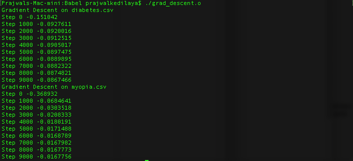

# Babel
End Goal: iPhone app to translate a foreign language in real-time

Licensed under the [MIT License](https://opensource.org/licenses/MIT)

## Install Libaries

```
brew install armadillo
brew install libsndfile
brew install gnuplot --with-qt
brew install fftw
```

## Build Code

```
g++ file.cpp -o file.o 
```

## Build Flags for Libraries

Armadillo

```
-O2 -larmadillo
```

Libsndfile

```
-lsndfile
```

FFTW

```
-lfftw3
```

## Run Code
```
./file.o
```

## Roadmap
   Logistic regression with gradient descent ✓
   
    
   
   Graph loss over time steps ✓
   
    
   
   Spectrogram of wav file
   
   1 hidden layer neural network
   
   Restricted Boltzmann Machine (RBM)
   
   Convolutional Deep Belief Network (CDBN)

   Lexicon of french phrases to english phrases
   
   Audio files of french phrases from Mac say tool
   
   Features learned using french phrase audio and CDBN
   
   Classification model
   
   Train model
   
   Deploy app on iPhone for Bluetooth earbuds

## External Datasets to Use:
   http://marsyasweb.appspot.com/download/data_sets/ , files vs. music genre
   
   http://archive.ics.uci.edu/ml/datasets/Pima+Indians+Diabetes , body measurements vs. existence of diabetes ✓
   
   https://www.umass.edu/statdata/statdata/stat-logistic.html , myopia factors vs. existence of myopia ✓
   
   https://archive.ics.uci.edu/ml/datasets/Iris , flower measurements vs. iris type
   
   http://yann.lecun.com/exdb/mnist/ , image of number vs. number
   
   http://www.manythings.org/bilingual/ , translation corpus for english vs. other other languages

## References:
   Andrew Ng paper on speech classification, after feature learning with CDBN

   http://papers.nips.cc/paper/3674-unsupervised-feature-learning-for-audio-classification-using-convolutional-deep-belief-networks.pdf
   
   Montreal paper on music genre classification, after feature learning with CDBN
   
   http://ismir2010.ismir.net/proceedings/ismir2010-58.pdf

   RBM implementation in Python

   https://github.com/echen/restricted-boltzmann-machines

   DARPA Mechanical Turk Case Study for Arabic translation
   
   https://requester.mturk.com/case_studies/cs/darpa
   
   Google paper on offline speech recognition
   
   http://arxiv.org/pdf/1603.03185.pdf
