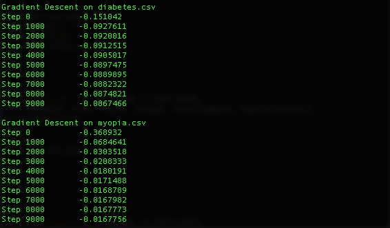

# Babel
End Goal: iPhone app to translate a foreign language in real-time

Licensed under the [MIT License](https://opensource.org/licenses/MIT)

## Install Libaries

```
brew install armadillo
brew install libsndfile
brew install gnuplot --with-qt
brew install fftw
```

## Build Code

```
g++ file.cpp -o file.o -std=c++11
```

## Build Flags for Libraries

Armadillo

```
-O2 -larmadillo
```

Libsndfile

```
-lsndfile
```

FFTW

```
-lfftw3
```

## Run Code
```
./file.o
```

## Roadmap
Simple logistic regression with gradient descent ✓
   

   
Graph loss over time steps ✓
   

   
Spectrogram ✓
   
440 Hz sound, FFT Length of 1024


   
440 Hz sound, FFT Length of 128


   
Simple 1 hidden layer neural network ✓


Lexicon of french phrases to english phrases ✓

Simple recurrent neural network (RNN)

Use RNN to create fixed-length feature vector from variable-length audio

Research how to train for variable length output
   
Audio files of all french phrases from Mac say tool

Create lookup for output sequence

Train algorithm
   
Deploy app on iPhone for Bluetooth earbuds

## External Datasets to Use:
   http://archive.ics.uci.edu/ml/datasets/Pima+Indians+Diabetes , body measurements vs. existence of diabetes ✓
   
   https://www.umass.edu/statdata/statdata/stat-logistic.html , myopia factors vs. existence of myopia ✓
   
   http://yann.lecun.com/exdb/mnist/ , image of number vs. number
   
   http://marsyasweb.appspot.com/download/data_sets/ , files vs. music genre
   
   http://www.manythings.org/bilingual/ , translation corpus for english vs. other other languages ✓

## References:
   Andrew Ng paper on speech classification, after feature learning with CDBN

   http://papers.nips.cc/paper/3674-unsupervised-feature-learning-for-audio-classification-using-convolutional-deep-belief-networks.pdf
   
   RBM implementation in Python

   https://github.com/echen/restricted-boltzmann-machines
   
   An Introduction to Restricted Boltzmann Machines, pseudocode and explanation of use and limitations
   
   http://image.diku.dk/igel/paper/AItRBM-proof.pdf
   
   Montreal paper on music genre classification, after feature learning with CDBN
   
   http://ismir2010.ismir.net/proceedings/ismir2010-58.pdf

   DARPA Mechanical Turk Case Study for Arabic translation
   
   https://requester.mturk.com/case_studies/cs/darpa
   
   Google paper on offline speech recognition
   
   http://arxiv.org/pdf/1603.03185.pdf
